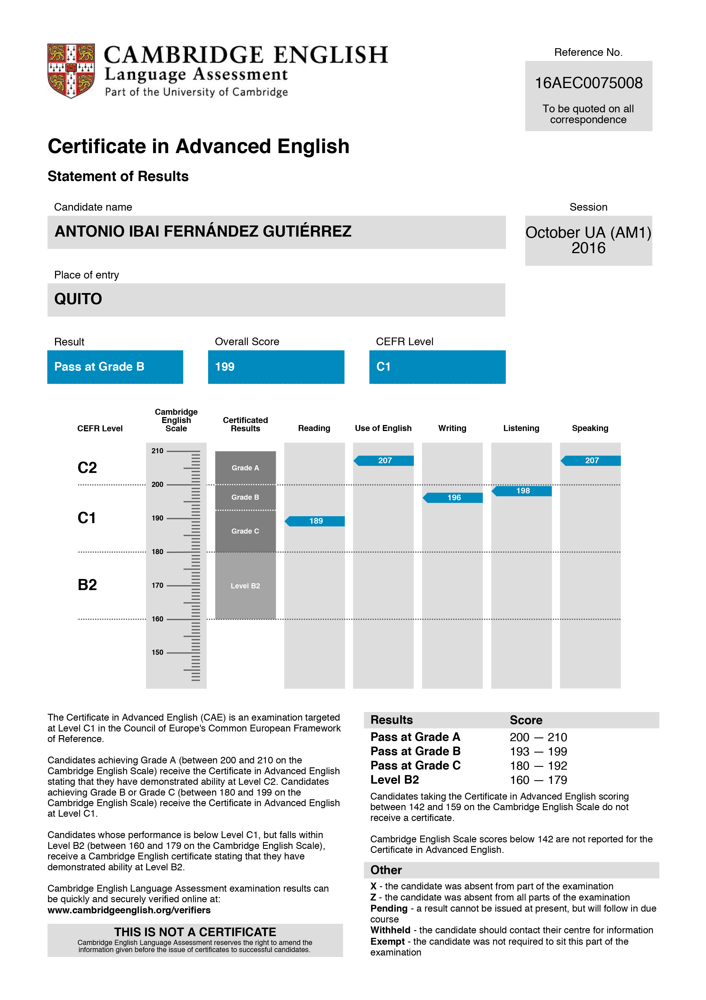

<h1> Ibai Fernández</h1>

<h2>Personal Data</h2>

<ul style="column-count:2; column-gap:60px">
    <li><strong>Name</strong>: Ibai Fernández</li>
    <li><strong>Birth Year</strong>: 1985</li>
    <li><strong>Nationality</strong>: Spanish</li>
    <!-- <li><strong>Country of residence</strong>: Ecuador (since 2014)</li> -->
    <li><strong><em>Motto</em></strong>: 'Nulla dies sine linea'</li>
</ul>

<strong><em>Nulla dies sine linea</em></strong> is a Latin phrase meaning “no day without a single line”. It finds its source in Pliny the Elder (<em>Natural History</em>, XXXV, 84), where the idea applies to the Greek painter Apelles, who did not go a day without drawing at least one line. But it is only in the <em>Proverbiorum libellus</em> by Polydore Vergil (1470-1555) in which the phrase itself is attested for the first time.

### Focus

Organized and motivated employee specially focused on time management, capable of working under pressure
in many different environments. Seeking to join an organization where I can make the best out of my potential,
contributing to the organization's growth, as the organization contributes to mine.

### Summary

Highly versatile entrepreneur with 9+ years of experience in setting up self-sustainable businesses and partaking
in corporate environments. Responsible for planning and directing daily operations, coming up with new ideas,
managing conflicts, supervision, sales, customer service, and marketing.

Always with the most positive attitude and ready to help others along the same path that I have chosen, I have
created my theoretical business model, regarding which I am always open to performing any adjustments necessary
based on each venture's particular needs.

Used to working outside the typical workdays, the strongest parts of my skill set are related to time management,
project managing (both planning and decision making), and leadership (for which a strong sense of communication
always comes in quite handy).

## Goals & Dreams

-   Develop a career as full-stack developer
-   Living a digital nomad's life
-   Writing many things which are worth reading
-   Making full-length films (at least one!)
-   Recording my own rock'n'roll album
-   Publishing my own app

## Academic Background (in a nutshell)

-   Full-Stack Development
-   Audiovisual & Intercultural Communication
-   Marketing & Digital Marketing
-   Spanish and Spanish Literature
-   Acting & Filmmaking
-   Design Thinking
-   Teaching

## Professional Experience

<h3 style="font-size:24px;">AGLAYA · Digital Marketing & Innovation</h3>

> Project & Accounts Manager
>
> Jul, 2019 - Jan, 2023

Marketing agency specialized in the implementation of marketing, communication and creativity strategies applied to the optimization of businesses of any size.

#### **Tasks & Responsibilities**

-   **Account and project management**

    -   Planning, supervision and execution

    -   Team coordination and training

-   **Customer life cycle management**

    -   Compilation of requirements

    -   Development and presentation of solution proposals

    -   Presentation of milestones and input management

    -   Customer training

    -   Supervision and assistance in the implementation and post-implementation of products and services

-   **Preparation and management of budgets and resources**

-   **Content production**

    -   Photography

    -   Audiovisual production and editing

    -   Creation and edition of articles for blogs and social networks

    -   Advertising writing

-   **Branding**

    -   Brand development: naming & branding

-   **Digital strategy**

    -   Optimization for search engines (SEO)

    -   Social media management

    -   Digital advertising

-   **Teaching**

    -   Training

    -   Conferences & Lectures

**Media**

---

<h3 style="font-size:24px;">NIC.ec</h3>

> -   Marketing Manager || Jun, 2018 - Jul, 2019
>
> -   MKT & Comms Director || Jun, 2016 - Jun, 2018
>
> -   Creative Director || Feb, 2016 - Jun, 2016

NIC.ec is the company designated by EcuadorDomains, the only company authorized by ICANN as provider of the territorial domain .ec, for the administration of such ccTLD.

NIC.ec has 18 years of operation, more than 45,000 nationally and internationally active domains and 1,000 more activated monthly. NIC.ec not only provides all commercial domain names, but also government, educational, military and financial names, among many others.

#### **Tasks & Responsibilities**

-   Campaign Planning
-   Production Planning
-   Team Management
-   Creative Direction
-   Art Direction
-   Photography
-   Publicity Campaigns
-   Video Ads Production
-   Commercial Strategy Planning
-   Commercial Operations Pitching & Supervision
-   Digital Strategy Planning & Execution
-   Improvement of communication flow among departments
-   Public Relationships
-   Coordination and execution of a national project to digitize entrepreneurs

---

<h3 style="font-size:24px;">Elm St. Productions</h3>

> Founder
>
> May, 2008 - Feb, 2016

Creative laboratory run by professionals who are experts in graphic design, photography, communication, advertising, film and television, writing, musical composition, and audiovisual production.

**Media**

---

<h3 style="font-size:24px;">teleSUR English</h3>

> Audiovisual Producer
>
> May, 2014 - May, 2015

teleSUR English is an alternative representation for world news focused on the people, the common citizens, and their stories, generally untold by traditonal media.

#### **Tasks & Responsibilities**

-   Digital Content Production: Documentary pieces, Newscasts, Late Night format
-   Production Studio Management
-   Shooting Crew Management

---

<h3 style="font-size:24px;">LaSoga Films</h3>

> Camera Crew
>
> November, 2011

<strong>LaSoga Films</strong> is a film production company created in 2010 by Cristina Bodelón, Jaime Otero Romaní and Nacho de Vicente, with the aim of telling stories that move the viewer, always made with the highest technical quality.

<em>The Common Enemy</em> is a documentary in the style of a political thriller about the first elections in the country that started the Arab Spring. After 23 years of cruel and corrupt dictatorship, the Tunisian people managed to overthrow the government of dictator Ben Ali, starting the Arab Spring. This fact is now echoing in the minds of Tunisians as they prepare for a crucial election in the country's history.

#### **Tasks & Responsibilities**

-   Equipment Maintenance
-   Camera Operations
-   Direction of Photography
-   Carrying interviews

<h2 style="margin-top:50px;">Academic Experience</h2>

<h3>Full-Stack Certificate</h3>

4Geeks Academy  Dec, 2022 - Apr, 2023

<strong>4Geeks Academy</strong> is the place where developers grow and thrive. Licensed by the USA F. Dep. of Education. Chosen as one of the top 35 bootcamps of the world and top coding bootcamp in Miami according to SwitchUp. Recognized as the top 10 coding bootcamps in the United States according to Newsweek.

Fields of study

-   HTML
-   CSS
    -   Bootstrap
    -   Saas
    -   Tailwind
-   CLI
-   Git
-   GitHub
-   JavaScript
-   JEST Testing Units
-   Webpack
-   Node.js
-   React
-   SQL
-   Python

---

<h3>ExEd in Digital Marketing</h3>

Universidad de Especialidades del Espíritu Santo (Guayaquil, Ecuador)  2018

The goal of the <strong>Digital Marketing ExEd Course</strong> is to create effective, cutting-edge professionals who are able to sell a company's brand, goods, and services thru a successful use of all marketing tools and strategies, including PPC, SEO, SEM, email, social media, and display advertising.

Fields of study

-   Fundamentals of Online Marketing
-   Introduction to SEO: Search Engines
-   SEM
-   Social Media
-   Digital Advertising
-   Programmatic Advertising
-   Branded Conten.
-   Inbound Marketing
-   Marketing Plan: Branding
-   Marketing Plan: Performance

---

<h3>ExEd in Design Thinking</h3>

Massachusetts Institute of Technology  2018

<strong>Design Thinking</strong> is a powerful approach to new product development that begins with understanding unmet customer needs. It's a human-centered design process that approaches problem-solving with understanding the user needs. Design Thinking encompasses concept development, applied creativity, prototyping, and experimentation. When design thinking approaches are applied to business, the success rate for innovation has been seen to improve substantially.

---

<h3>BA in Audiovisual Communication</h3>

Universidad de Málaga (Málaga, Spain) 2004 - 2010

The <strong>BA in Audiovisual Communication</strong> aims to provide general and systematic training, with the appropriate scientific and humanistic foundation, so that communication through images contemplates a reflective and critical process on its role in history and the generation of social imaginaries.

Fields of study

-   Communication Theories
-   Audiovisual Law
-   Still Image History
-   History of Cinema
-   Communication Psychology
-   Analysis of the Current Context and its Historical Evolution
-   Sociology of Communication
-   Journalistic Construction of Reality
-   Advertising
-   Public relations
-   Audiovisual Narrative
-   Theories and Research in Audiovisual Communication
-   History of Audiovisual Media
-   Still Image Technique and Editing
-   Audiovisual Production
-   Film Script
-   Spanish literature
-   Management and Audiovisual Production
-   Promotion and Marketing of Audiovisual Products
-   Audiovisual production
-   Image Theory and Analysis
-   Spanish cinema
-   Audiovisual Creation
-   Stage Direction
-   Art Direction
-   Direction of Photography
-   Graphic Design
-   Informative Documentation
-   Contemporary Art Movements
-   Photography
-   Film and Video Postproduction

---

<h3>ExEd in Intercultural Communication</h3>

Haagse Hogeschool (The Hague, Netherlands) Sep, 2006 - May, 2007

<strong>Intercultural Communication</strong> students study the ways in which ideas, information and data are represented, negotiated and communicated across different languages, cultures and media. They explore how language and culture affects the interpretation of messages.

Fields of study

-   American Studies
-   Art and Globalization
-   Contemporary British Studies
-   Dutch Language
-   Events Organization
-   Introduction to Advanced Writing
-   Italian Language
-   Japanese Studies
-   Project "Europe Calling"

---

<h3>ExEd in Production and Media Management</h3>

Missouri State University (Springfield, MO, USA) Aug, 2007 - May, 2008

<strong>Media Production and Management</strong> involves the studdy of the planning, scheduling, filming, editing, and commercialization of audiovisual products. Everything that working behind the scenes entails in video, radio, television, and movies.

Fields of study

-   TV Production
-   Media Analysis and Criticism
-   Communication Research Methods
-   Introduction to Media Business
-   Broadcast Industry
-   Investment Opportunities
-   Introduction to Multimedia Production
-   TV & Film Production
-   Sound Editing & Mixing
-   Media Design & Production
    — Broadcast Management

<h5 style="text-align:right;">GPA: 3.16</h5>

---

<h3>Master's Degree in Learning Disabilities - Spanish Language and Literature</h3>

Universidad de Salamanca (Salamanca, Spain) Sept, 2015 - Jun, 2018

The <strong>Master's Degree in Learning Disabilities</strong> provides all the necessary knowledge and skills to address and understand the way in which people with learning disorders and difficulties understand the world, what is their way of processing information, feeling and perceive.

Fields of study

-   Processes and Acquisition of Reading and Writing
-   Difficulties in Learning to Read and Write - Assessment and Intervention
-   Processes and Acquisition of Skills of Texts Comprehension and Writing
-   Difficulties in Comprehension and Writing - Assessment and Intervention
-   Processes and Acquisition of Linguistic Skills
-   Disability and Learning Difficulties
-   Difficulties in Learning - Linguistic Problem Resolution
-   Cognitive and Emotional Processes in the Human Mind
-   Attention Deficit Disorders and Behavioral Difficulties
-   Specific Oral Language Difficulties
-   Counseling and Intervention in Academic Centers
-   Analysis of Educational Practice
-   Organization of Interventional Aid

## Languages

-   Spanish · Native
-   English · Bilingual
    -   EFSET (2022) — **[C2 Proficient · 85/100](https://www.efset.org/cert/VRFYRN)**
    -   Cambridge English (2016) — **C1 Proficient · 199/210**

<h2 style="margin-top:-10px;">Projects</h2>

-   Andariega Store

    <!-- role: Founder & Owner
    time: 2016 - Present
    company: Andariega Store
    company_logo: https://ibaifernandez.com/wp-content/uploads/2022/12/Andariega.jpg
    details: |
    Crafts & design workshop focused on customization and exclusivity.
    - Website: https://www.andariega.store -->

-   Kombutxa Índika

    <!-- role: Founder & Owner
    time: 2018 - Present
    company: Kombutxa Índika
    company_logo: https://ibaifernandez.com/wp-content/uploads/2022/12/Kombutxa-Indika.jpg
    details: |
    Best kombucha ever brewed. 20 times as alcoholic as any other kombutxa without the sour taste.
    - Website: https://www.indika.ec -->

-   Un final para su final

-   El oficio de escritor · Reflexiones de un escritor primerizo

## Contact

## Digital Presence

## Interests & Hobbies

-   Writing
-   Mixology
-   Music
-   Literature

<!-- ## My portfolio

### Tribute to Charles Bukoswki

A tribute page to Charles Bukoswki as requested by Free Code Camp's exercises.

-   [See it live!](https://ibaifernandez.github.io/freecodecamp-projects/tribute-page/index.html)

-   [See the repo](https://github.com/ibaifernandez/freecodecamp-projects/tree/main/tribute-page)

~ Much More Coming Soon! ~

    -   title: Elm St. Productions' Website
        project_logo: https://ibaifernandez.com/wp-content/uploads/2022/12/elmst.jpeg
        link: "https://elmst.net"
        tagline: "Elm St. Productions' Website - An Audiovisual Production Company."

    -   title: Humans vs. Zombies
        project_logo: https://ibaifernandez.com/wp-content/uploads/2022/12/humans-vs-zombies.jpeg
        link: "https://ibaifernandez.github.io/rock-paper-scissors-vs-zombies/"
        tagline: "Defeat zombies in a deadly game of rock, paper and scissors."

    -   title: Google Custom Homepage
        project_logo: https://ibaifernandez.com/wp-content/uploads/2022/12/google-custom.jpeg
        link: "https://ibaifernandez.github.io/google-homepage/google-homepage-custom.html"
        tagline: "Google's custom homepage, as requested by The Odin Project's exercises."

    -   title: Google Standard Homepage
        project_logo: https://ibaifernandez.com/wp-content/uploads/2022/12/google-standard.jpeg
        link: "https://ibaifernandez.github.io/google-homepage/google-homepage-standard.html"
        tagline: "Google's standard homepage, as requested by The Odin Project's exercises."

    -   title: Google Results Page
        project_logo: https://ibaifernandez.com/wp-content/uploads/2022/12/google-results.jpeg
        link: "https://ibaifernandez.github.io/google-homepage/google-homepage-results.html"
        tagline: "Google's result page, as requested by The Odin Project's exercises."

    -   title: Text-Based Role Playing Game
        project_logo: https://ibaifernandez.com/wp-content/uploads/2022/12/rpg.jpeg
        link: "https://ibaifernandez.github.io/rpg/"
        tagline: "Text-based Role Playing Game (in process)."

    -   title: My Beautiful Postcard
        project_logo: https://ibaifernandez.com/wp-content/uploads/2022/12/my-beautiful-postcard.jpeg
        link: "https://ibaifernandez.github.io/my-beautiful-postcard/"
        tagline: "My Beautiful Postcard is one of the exercises requested by 4Geeks Academy."

    -   title: Instagram Mockup
        project_logo: https://ibaifernandez.com/wp-content/uploads/2022/12/instagram-mockup.jpeg
        link: "https://ibaifernandez.github.io/instagram-mockup/"
        tagline: "Instagram Mockup is one of the exercises requested by 4Geeks Academy."

    -   title: My Portfolio
        project_logo: https://ibaifernandez.com/wp-content/uploads/2022/12/Portafolio-Ibai-Fernandez.jpg
        link: "https://ibaifernandez.github.io/"
        tagline: "My portfolio."

## Skills

-   Creativity: 90%

-   Communication: 90%

-   Writing: 90%

-   Teaching: 90%

-   Photography: 90%

-   Audiovisual Production: 90%

-   Project Management: 90%

-   Team Management: 90%

-   Marketing & Digital Marketing: 90%

-   Digital Advertising: 90%

-   Graphic Design: 75%

-   HTML: 85%

-   CSS: 75%

-   JavaScript: 65%

-   Wordpress: 85%
 -->
