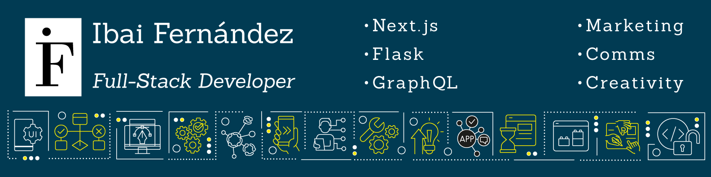

    
    

        
    

<h2 style="margin-bottom:25px;">About me</h2>

<code><Hello, World! 🌎 I am Ibai Fernández, passionate about programming! 💻 /></code>

-   🇪🇸 I am from Málaga, Spain 🇪🇸
-   🌎 I have lived in LatAm since 2014 — for 9+ years in Ecuador, and currently in Bogota, Colombia 🌎
-   🥰 I love programming! 🥰
-   🤩 I like to dismantle things to put them back together (no matter how many screws go M.I.A.!) 🤩
-   📚 🎸 🎥 I like "all things creative" —wrote books and songs, even made my own short movies! 📚 🎸 🎥
-   :relieved: 'Why' is more important than 'how'. 'How' is more important than 'what' :relieved:

## Languages, libraries, frameworks & tools which I love

## I love messages, so feel free to contact me!

## My digital presence

## I code to the sound of music! 🎧

    

    <h3>~ 😉 Looking forward to getting in touch with you! 😉 ~</h3>

