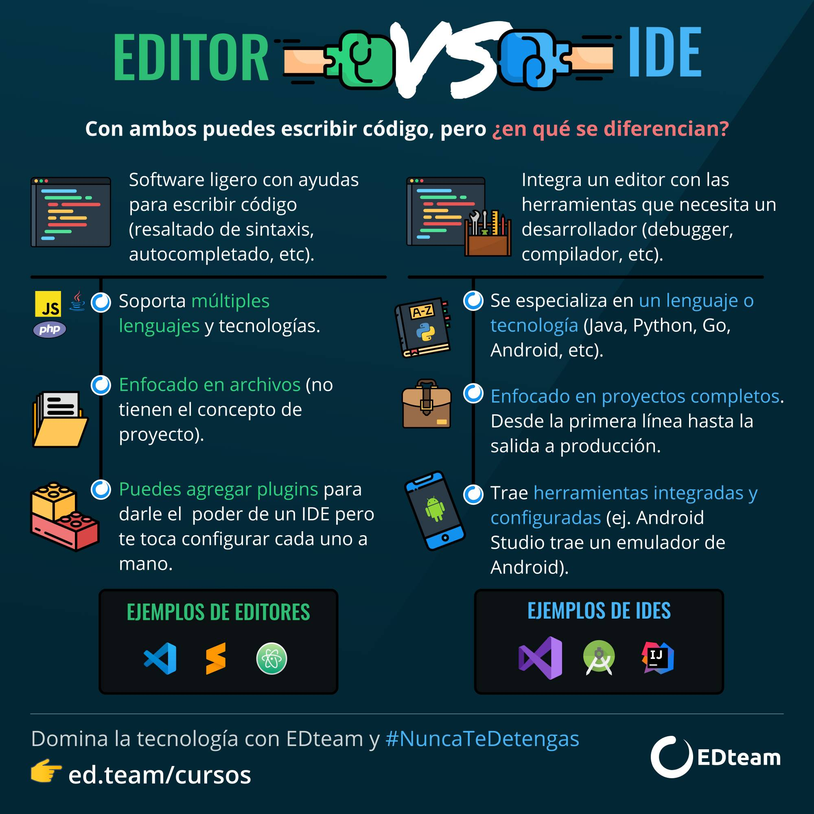
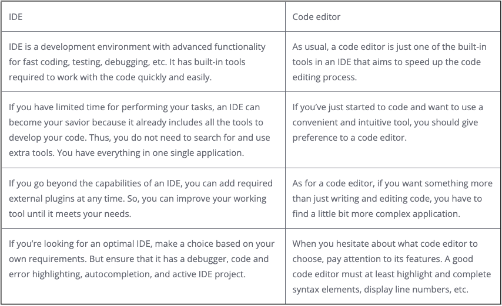

# **Code Editors**

## **Differences among a code editor and a IDE**

-   Basically, **code editors** are enhanced text editors that streamline and accelerate routine coding.

-   An **IDE** (Integrated Development Environment) is the most advanced programming solution, comprising multiple tools in a single application —and, thus, streamlining all operations of a software/database developer.

---

### Resources

-   [The Difference Between an IDE and a Code Editor](https://blog.devart.com/difference-between-ide-and-code-editor-explained.html)
