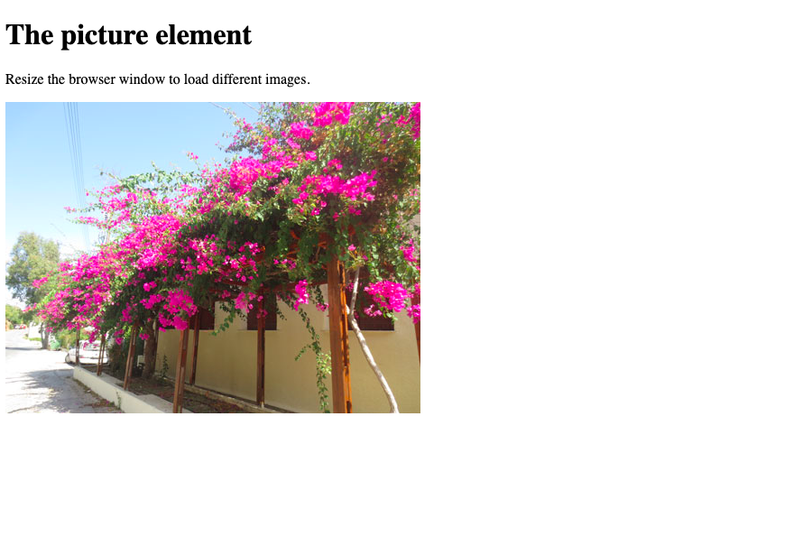

# **HTML**

## **(1) Meta tags**

### **(1.1) Meta tag `viewport`**

HTML5 introduced a method to let web designers take control over the viewport, through the `<meta>` tag.

You should include the following `<meta>` viewport element in all your web pages:

`<meta name="viewport" content="width=device-width, initial-scale=1.0">`

This gives the browser instructions on how to control the page's dimensions and scaling.

The `width=device-width` part sets the width of the page to follow the screen-width of the device (which will vary depending on the device).

The `initial-scale=1.0` part sets the initial zoom level when the page is first loaded by the browser.

### **(1.2) Meta tag `http-equiv`**

???

### **(1.3) Meta tag Open Graph (`og:`)**

**Open Graph** is an internet protocol that was originally created by Facebook to standardize the use of metadata within a webpage to represent the content of a page.

Within it, you can provide details as simple as the title of a page or as specific as the duration of a video. These pieces all fit together to form a representation of each individual page of the internet.

### Resources

-   [What is Open Graph and how can I use it for my website?](https://www.freecodecamp.org/news/what-is-open-graph-and-how-can-i-use-it-for-my-website/)

### **(1.4) `keywords, author, description`...**

#### **The Most Important Meta Tags For SEO in 2022**

The 8 major met tags which can improve the optimization of your website are

-   Title tag
-   Meta description
-   Canonical Tag
-   Alternative text (Alt) Tag
-   Robots meta tag
-   Social Media Meta Tags (Open Graph and Twitter Cards)
-   Responsive Design Meta Tag

### Resources

-   [Meta Tags in 2022: Why are They Important in SEO?](https://www.advancedwebranking.com/blog/meta-tags-important-in-seo/)

### **(1.5) HTML specification**

-   **How important is to use every single HTML according to their specific use?**

Example: is it necessary to put every single `img` tag into a `figure` tag?

The question that actually matters is **"To whom do source code semantics matter?"**. And the answer might be:

-   To anyone who's interacting with the source code but not the presentation — search engines, screen readers...

-   To yourself, trying to efficiently maintain and expand your own code over time.

-   To the future of the web, as this is to have pages browsed on many different kinds of devices.

### Resources

-   [How important are the layout specific semantic html elements?](https://stackoverflow.com/questions/29827319/how-important-are-the-layout-specific-semantic-html-elements)

### **(1.6) HTML Accesibility for all audiences**

**ARIA**, also known as **WAI-ARIA**, stands for **_Accessible Rich Internet Applications_**. ARIA defines a variety of markup extensions, usually HTML5 attributes, that can be added to elements to give screen readers more information about the element and help visually-impaired users better grasp what’s happening on the webpage.

## **(2) The `<picture>` and the `srcset` attribute for the `<source>` tag**

### **(2.1) The `<picture>`tag**

The `<picture>` tag gives web developers more flexibility in specifying image resources.

The most common use of the `<picture>` element will be for art direction in responsive designs. Instead of having one image that is scaled up or down based on the viewport width, multiple images can be designed to more nicely fill the browser viewport.

The `<picture>` element contains two tags: one or more `<source>` tags and one `` tag.

The browser will look for the first `<source>` element where the media query matches the current viewport width, and then it will display the proper image (specified in the srcset attribute). The `` element is required as the last child of the `<picture>` element, as a fallback option if none of the source tags matches.

**Tip**: The `<picture>` element works "similar" to `<video>` and `<audio>`. You set up different sources, and the first source that fits the preferences is the one being used.

### **(2.2) The `srcset` attribute for the `<source>` tag**

The `srcset` attribute specifies the URL of the image to use in different situations.

This attribute is required when <source> is used in <picture>.

**Example**:

    <!DOCTYPE html>
    <html>
        <head>
            <meta name="viewport" content="width=device-width, initial-scale=1.0">
        </head>

        <body>

            <h1>The picture element</h1>

            
Resize the browser window to load different images.

            <picture>
                <source media="(min-width:650px)" srcset="img_pink_flowers.jpg">
                <source media="(min-width:465px)" srcset="img_white_flower.jpg">
                
            </picture>

        </body>
    </html>

1. When the screen where this code is being shown goes **above** 650px (this is, 650px width _or more_), the browser displays **`img_pink_flowers.jpg`**, like so:

---

---

2. When the screen where this code is being shown goes **above** 465px (this is, among 465 _and_ 649 pixels width), the browser displays **`img_white_flowers.jpg`**, like so:

---

---

2. Finally, in any other case scenario (this is, _below_ the 465 pixels width), the browser displays **`img_orange_flowers.jpg`**, like so:

---

---
