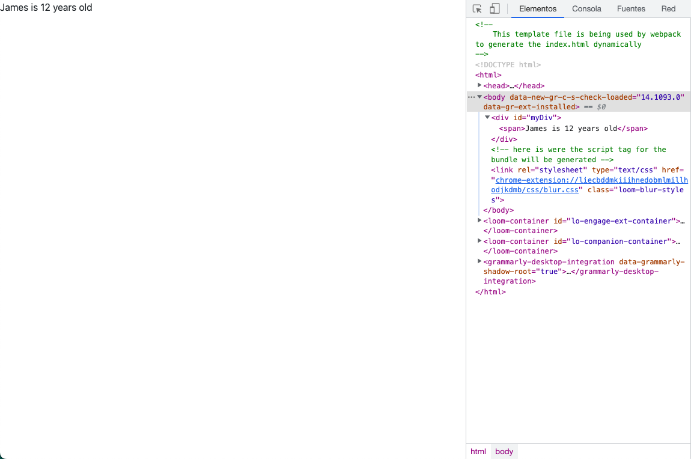
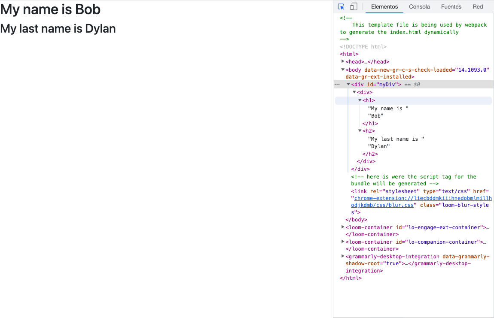
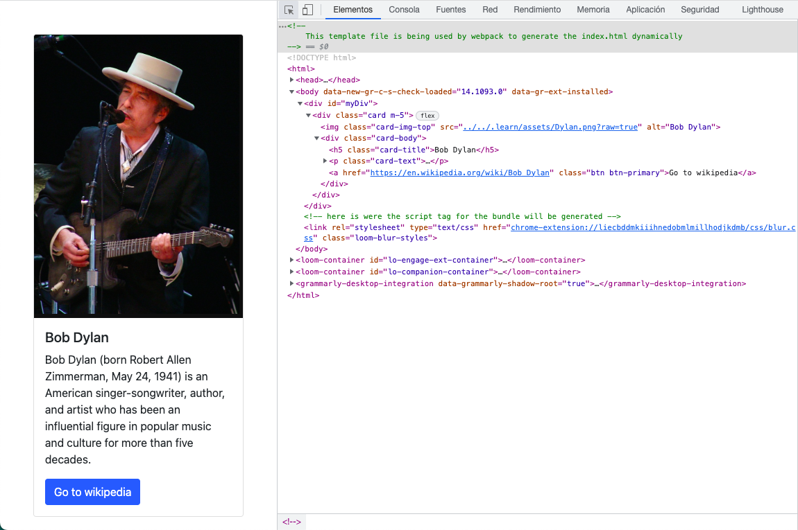
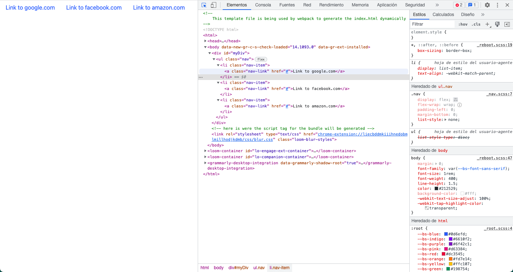
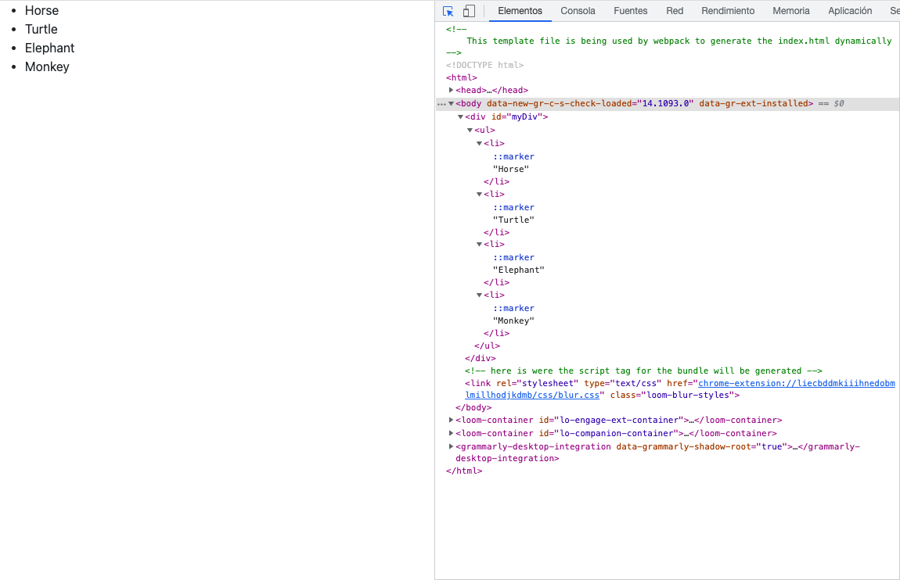
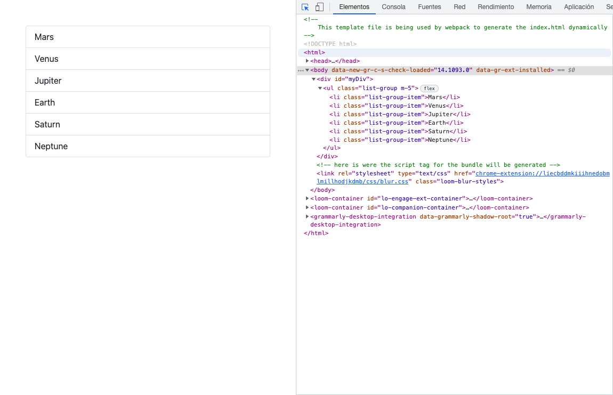
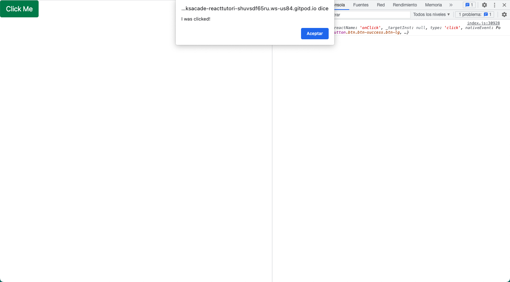

# Understanding React

## 1 Hello World

1. React.js is a rendering library.

    - What is a rendering library?

2. React.js comes with a function called `ReactDOM.render` that can be seen as a replacement for the classic `innerHTML` property.

    - The ReactDOM.render function receives two parameters:

        - What to render (the inner HTML).

        - Where to render it (DOM element).

**Example**:

```
import React from 'react'; // Import the react library.
import ReactDOM from 'react-dom'; // Import reactDOM to make React generate HTML

let output = <span>James is 12 years old</span> // HTML that will be rendered

const myDiv = document.querySelector('#myDiv'); // A DOM element that will contain the HTML generated by React

ReactDOM.render(output, myDiv);

```

**Result**:



### 1.1 Hello JSX

JSX enables us to easily include variables into our HTML. For instance, if we have the variable:

`let age = 12;`

We can use curly braces to call variables _dynamically_ into our HTML code:

`let output = <span> James is { age } years old </span>

**Example**:

```

import ReactDOM from 'react-dom'; // Using react-dom to render whichever content into the DOM

let age = 12; // Variable declaration #1
let name = James; // Variable declaration #2

let output = <span>{ name } is { age } years old </span> // Note the position of the curly brackets wrapping the variable

ReactDOM.render(output, document.querySelector('#myDiv')); // Rendering "output" inside #myDiv

```

The resulting website HTML document will look like this:

**Result**:

```
<div id="myDiv">
    <span>James is 12 years old</span>
</div>
```

### 1.2 Rendering from objects

We have the following JS object containing a customer information:

```

const customer = {
    first_name: 'Bob',
    last_name: 'Dylan'
};

```

To retrieve any property from the `customer` object we have to use the dot (.) operator like so:

```
console.log(customer.first_name); // Will print "Bob" on the console.
```

**Example**:

    import React from "react";
    import ReactDOM from "react-dom";

    const customer = {
    first_name: "Bob",
    last_name: "Dylan"
    };

    const output = (
        <div>
            <h1>My name is {customer.first_name}</h1>
            <h2>My last name is {customer.last_name}</h2>
        </div>
        );

    ReactDOM.render(output, document.querySelector("#myDiv"));

**Result**:



### 1.3 Building a layout

Let's use **React** to create a **Bootstrap Card** with the information contained into the following `data` object.

    const data = {
        image: "../../.learn/assets/Dylan.png?raw=true",
        cardTitle: "Bob Dylan",
        cardDescription: "Bob Dylan (born Robert Allen Zimmerman, May 24, 1941) is an American singer/songwriter, author, and artist who has been an influential figure in popular music and culture for more than five decades.",
        button: {
            url: "https://en.wikipedia.org/wiki/Bob_Dylan",
            label: "Go to wikipedia"
        }
    };

    import React from "react"; //Main React.js library
    import ReactDOM from "react-dom"; //we use ReactDOM to render into the DOM

    let content = (
        <div className="card m-5">
            
            <div className="card-body">
                <h5 className="card-title">{data.cardTitle}</h5>
                <p className="card-text">{data.cardDescription}</p>
                <a href={data.button.url} className="btn btn-primary">
                    {data.button.label}
                </a>
            </div>
        </div>
    );

    ReactDOM.render(content, document.querySelector("#myDiv"));

**Result**:



### 1.4 Building from arrays

With **React** (`.jsx` files), arrays can be used to generate HTML items. When retrieving information from an array, **React** will yield each element of the array. For instance:

    // We have an array with 4 elements
    const namesInHTML = [
        <li>Bob Dust</li>,
        <li>Fredy Mercury</li>,
        <li>Shazam Nikola</li>,
        <li>Wilibin Walabam</li>
    ];

    // We call the array _dynamically_ within the variable that we will later render within the "ReactDom.render" statement.

    const content = <ul>{namesInHTML}</ul>;

    ReactDOM.render(content, document.querySelector("#myDiv"));

Doing so, the array will be _iterated_ yielding each one of its elements:

    <div id="myDiv">
        <ul>
            <li>Bob Dust</li>
            <li>Fredy Mercury</li>
            <li>Shazam Nikola</li>
            <li>Wilibin Walabam</li>
        </ul>
    </div>

Now, we want React to render the following output:

    <ul class="nav">
        <li class="nav-item">
            <a class="nav-link" href="#">Link to google.com</a>
        </li>
        <li class="nav-item">
            <a class="nav-link" href="#">Link to facebook.com</a>
        </li>
        <li class="nav-item">
            <a class="nav-link" href="#">Link to amazon.com</a>
        </li>
    </ul>

This would be the necessary code:

    import React from "react"; // Main React.js library
    import ReactDOM from "react-dom"; // We use ReactDOM to render into the DOM

    const navlinkItems = [
        <li key="1" className="nav-item">
            <a className="nav-link" href="#">
                Link to google.com
            </a>
        </li>,
        <li key="2" className="nav-item">
            <a className="nav-link" href="#">
                Link to facebook.com
            </a>
        </li>,
        <li key="3" className="nav-item">
            <a className="nav-link" href="#">
                Link to amazon.com
            </a>
        </li>,
    ];

    const content = <ul className="nav">{navlinkItems}</ul>;

    ReactDOM.render(content, document.querySelector("#myDiv"));

**Result**:



#### What about those `key`s?

React _requests_ `key`s to be used on each item of the array. These `key`s can either be hard-coded, like in the previous example, or added _dynamically_, as we will see next. Some notes on `key`s:

-   A `key` is a special `string` attribute you need to include **when creating lists of elements in React**.

-   `key`s are used in React **to give an identity to the elements\* in the lists **in order to know which items in the list are changed, updated, or deleted\*\*.

-   It is recommended to use a `string` as a `key` that uniquely identifies the items in the list.

-   Array indexes can also be assigned as `key`s to the list items, although this is highly discouraged because if the elements of the arrays get reordered in the future, it will get confusing for the developer as the `key`s for the elements will also change.

## 2 Mapping array to `<li>` (_aka_ "Changing `key`s dynamically")

Let's update this code's `.map` function to create a new array of `<li>`s so that each one of them corresponds to one animal from the original array.

    import React from "react";
    import ReactDOM from "react-dom";

    const animals = ["Horse", "Turtle", "Elephant", "Monkey"];

    const animalsInHTML = animals.map((singleAnimal, i) => {
        return <li key={i}>{singleAnimal}</li>;
    });

    ReactDOM.render(<ul>{animalsInHTML}</ul>, document.querySelector("#myDiv"));

**Result**:



#### Note the differences

You can note the differences among exercises 1.4 and 2.

In the first case, our array had the code hard-coded within, like so:

    const navlinkItems = [
        <li key="1" className="nav-item">
            <a className="nav-link" href="#">
                Link to google.com
            </a>
        </li>,
        <li key="2" className="nav-item">
            <a className="nav-link" href="#">
                Link to facebook.com
            </a>
        </li>,
        <li key="3" className="nav-item">
            <a className="nav-link" href="#">
                Link to amazon.com
            </a>
        </li>,
    ];

Whereas in Exercise 4, the array only had elements, but no code —like so:

    const animals = ["Horse", "Turtle", "Elephant", "Monkey"];

Therefore, in the first case we were able to render the content of our array just by declaring a constanct variable `content`, which happened to be a `<ul>` with our array called within among curly braces:

    const content = <ul className="nav">{navlinkItems}</ul>;

But in the second case (Exercise 4), we've had to use a `.map` function to _add_ the HTML code —including the `key` of each element and each element itself:

    const animalsInHTML = animals.map((singleAnimal, i) => {
        return <li key={i}>{singleAnimal}</li>;
    });

Note how, besides the iterated element (`singleAnimal`), we've alse used the second possible parameter of the `.map` function - which is the index of each iterated element on the mapped array - to generate each `key`.

### 2.1 Mapping array objects to `<li>`

Update the code's `.map` function to create a new array of `<li>`s, each one of them corresponding to one animal from the original array.

    import React from "react";
    import ReactDOM from "react-dom";

    const animals = [{ label: "Horse" }, { label: "Turtle" }, { label: "Elephant" }, { label: "Monkey" }];

    const animalsInHTML = animals.map((singleAnimal, i) => {
    	return <li key={i}>{singleAnimal.label}</li>;
    });

    ReactDOM.render(<ul>{animalsInHTML}</ul>, document.querySelector("#myDiv"));

#### Note the differences

In this case, the only difference is that an object's property have had to be accessed for each element of the original array instead of each element as such. This is:

    const animalsInHTML = animals.map((singleAnimal, i) => {
        return <li key={i}>{singleAnimal}</li>;
    });

versus

    const animalsInHTML = animals.map((singleAnimal, i) => {
    	return <li key={i}>{singleAnimal.label}</li>;
    });

### 2.2 Mapping array of objects to `<li>`

When **mapping an array of data** to convert it into **an array of HTML**, you have to specify a "mapping function" that will receive each item from the original _data array_, transform it and insert it into the new _HTML array_.

**Example**:

    import React from "react"; // Importing main React.js library
    import ReactDOM from "react-dom"; // Importing ReactDOM to render elements into the DOM

    const planets = ["Mars", "Venus", "Jupiter", "Earth", "Saturn", "Neptune"]; // Declaration of initial array ("Data Array")

    // Declaration of the "mapping function"
        // The function receives 2 args: each one of the elements of the initial array and their respective indexes
        // It utilizes the index for the key and the value of each item ("planet") as the innerHTML of the <li> tag
        // It adds the className "list-group-item" to convey Bootstrap standards in a hard-coded manner

    const myMappingFunction = (planet, i) => {
        return (
            <li key={i} className="list-group-item">
                {planet}
            </li>
        );
    };

    // The new "HTML Array" is created by passing the mapping function which we just created as argument of a `.map` function (instead of the iterated element and the index)

    const planetsInHTML = planets.map(myMappingFunction);

    // We need to define the content (the "What" of what our "ReactDOM.render" will render):

    const content = <ul className="list-group m-5">{planetsInHTML}</ul>;

    // We render the "content" (WHAT), within the box identified with the id "myDiv" (WHERE)

    ReactDOM.render(content, document.querySelector("#myDiv"));

**Result**:



#### Note the differences

In this case, all that we've done is creating a `.map` function independently to the declaration of the constant variable `content`. This is, instead of just rendering the HTML within the `.map` function:

    const animalsInHTML = animals.map((singleAnimal, i) => {
    	return <li key={i}>{singleAnimal.label}</li>;
    });

We have...

1.  ... built a (mapping) function:

        const myMappingFunction = (planet, i) => {
            return (
                <li key={i} className="list-group-item">
                {planet}
                </li>
            );
        };

2.  Initializing an array which will be the result of executing the `.map` function over our original array `planets` passing the (mapping) function that we have created **instead of any other parameters** (such as the iterated element and the index):

        const planetsInHTML = planets.map(myMappingFunction);
        console.log(planetsInHTML); // returns
                                    // [<li key={1} className="list-group-item">Mars</li>]
                                    // ...
                                    // [<li key={6} className="list-group-item">Neptune</li>]

3.  Finally, _dynamically_ calling the array resulting from the previous operation within the WHAT that will be rendered by the `ReactDOM.render()`:

    const content = <ul className="list-group m-5">{planetsInHTML}</ul>;

4.  Calling `ReactDom.render()`with the proper WHAT (constant variable `content` just created) and the WHERE.

    ReactDOM.render(content, document.querySelector("#myDiv"));

## 3 Render with Functions (_aka_ Creating Components)

### 3.1 Our first Component

1.  We create a function that will be the WHAT to be render by our `ReactDom.render()`:

        const PrintHello = () => {
            return <h1>Hello World</h1>;
        }

2.  We call ReactDOM.render() with a proper WHAT (the function just created) and a proper WHERE:

        ReactDOM.render(PrintHello(), myDiv);

#### Another example of a functional Component

1.  We create a function that renders HTML:

        const MyFunction = () => {
           return <h1>I Love React</h1>;
        }

2.  We call that function as a **self-closing** HTML tag, instead of using round brackets (this is, `myfunction()`):

        <MyFunction />

When a function is called like that (self-closing HTML tag), **it becomes a React component**: a function that returns HTML _dynamically_. The function's `return` statement will be placed where component (`<MyFunction />` is called.

### 3.2 A _real_ component

To create _simple_ HTML layouts, we can create **Components** (functions that return HTML) and call them as such by using a `<SelfClosingTag />`.

So let's imagine that we want to create - and use - a component that returns a Bootstrap card.

1.  This is the HTML code for a Bootstrap Card:

        <div class="card m-5">
            
            <div class="card-body">
                <h5 class="card-title">Bob Dylan</h5>
                <p class="card-text">Bob Dylan (born Robert Allen Zimmerman, May 24, 1941) is an American singer/songwriter, author, and artist who has been an influential figure in popular music and culture for more than five decades.</p>
                <a href="https://en.wikipedia.org/wiki/Bob_Dylan" class="btn btn-primary">Go to wikipedia</a>
            </div>
        </div>

2.  Let's remember, though, that we use `className` instead of `class` in React. Thus:

        <div className="card m-5">
            
            <div className="card-body">
                <h5 className="card-title">Bob Dylan</h5>
                <p className="card-text">Bob Dylan (born Robert Allen Zimmerman, May 24, 1941) is an American singer/songwriter, author, and artist who has been an influential figure in popular music and culture for more than five decades.</p>
                <a href="https://en.wikipedia.org/wiki/Bob_Dylan" className="btn btn-primary">Go to wikipedia</a>
            </div>
        </div>

3.  We create a **component** (function that returns HTML) as an anonymous arrow function:

        const Component = () => {
            returns (
                <div className="card m-5">
                    
                    <div className="card-body">
                        <h5 className="card-title">Bob Dylan</h5>
                        <p className="card-text">Bob Dylan (born Robert Allen Zimmerman, May 24, 1941) is an American singer/songwriter, author, and artist who has been an influential figure in popular music and culture for more than five decades.</p>
                        <a href="https://en.wikipedia.org/wiki/Bob_Dylan" className="btn btn-primary">Go to wikipedia</a>
                    </div>
                </div>
            );
        };

4.  We call the component within our `ReactDOM.render()`:

        ReactDOM.render(<Component />, document.querySelector("#myDiv"));

### 3.3 Component Properties

We can make our HTML _dynamic_ using **properties**, so that we can re-use these very `Components` over and over with different data —either hard-coded or called dynamically thru the `Component`s **`props`**.

> Note that **`<tag>`s' properties (_attributes_) are _anything_ behind the `<tag>`s' name**. This is, in `<a href="http://google.com">Take me to google</a>`, `<a>`is a tag and `href` is a property (_attribute_).

**Properties** can be arbitrarily named —this is, _attribute_ names which are not _natively inherent_ to HTML. Such as:

    <MyComponent text1="Hello" text2="World! />

In this case:

1. The `Component` is `<MyComponent />.

2. The first **property** is `text1`.

3. The second **property** is `text2`.

> For a exhaustive reference on this, please, read the documentation at [Landing Page with React](https://github.com/ibaifernandez/landing-page-with-react)

## 4 Conditional Rendering

As a `Component`is a piece of code that allows us to mix JS code and HTML code, within them we can, for instance, display HTML _conditionally_ (_aka_ make use of every Javascript functionality available: Variables, Loops, Conditionals, etc.)

For example, the next snippet returns two different HTML codes according to the (_boolean_) state of the **property** `show`each time the Component is called.

> Note that, in order for React to identify the **value** of a **Component's property** as a _boolean_, it must be inserted within curly brackets.

    import React from "react";
    import ReactDOM from "react-dom";

    const Alert = (props) => {
        if (props.show === false) {
            return (
                <div className="alert alert-danger" role="alert">
                    This is a {props.text} that you should <strong>not</strong> see as its "show" property is "{props.showText}".
                </div>
            );
        } else {
            return (
                <div className="alert alert-danger" role="alert">
                    This is a {props.text} that you should see as its "show" property is "{props.showText}".
                </div>
            );
        }
    };

    ReactDOM.render(
        <div>
            <Alert show={false} text="primary alert" showText="false" />
            <Alert show={true} text="primary alert" showText="false" />
        </div>,
        document.querySelector("#myDiv")
    );

**Another example**:

> Note how we're changing the Bootstrap class according to the **Component's property** `color`.

    import React from "react";
    import ReactDOM from "react-dom";

    const Alert = (props) => {
        if (props.color === "red") {
            return (
                <div className="alert alert-danger" role="alert">
                    {props.text}
                </div>
            );
        } else {
            return (
                <div className="alert alert-warning" role="alert">
                    {props.text}
                </div>
            );
        }
    };

    ReactDOM.render(
        <div>
            <Alert text="OMG! Something really bad has happended!" color="red" />
            <Alert text="Well, it is not that bad after all!" color="orange" />
        </div>,
        document.querySelector("#myDiv")
    );

**A third example**:

> 1. Note how, in this case, we're declaring an object variable _within_ our component, so that the scope of such variable will be _local_.
>
> 2. Also, please, note how a literal template is being used to create the `className` of the `<div>` that is being returned when `colorClasses[props.color]` is not `undefined`.
>
> 3. Finally, please, note that by adding a fourth call to the `<Alert />` Component with a color not defined within `colorClasses` would render and `alert`... and nothing else

    import React from "react";
    import ReactDOM from "react-dom";

    const Alert = (props) => {
        const colorClasses = {
            red: "alert-danger",
            orange: "alert-warning",
            green: "alert-success",
         };
        if (colorClasses[props.color] === undefined) {
            alert(`The color ${props.color} is not in the possible list of colors`);
        } else {
            return (
                <div className={`alert ${colorClasses[props.color]}`} role="alert">
                    {props.text}
                </div>
            );
        }
    };

    ReactDOM.render(
        <div>
            <Alert text="OMG! Something really bad has happended!" color="red" />
            <Alert text="Well, it is not that bad after all!" color="orange" />
            <Alert text="I am supposed to be green" color="green" />
            // <Alert text="I am gonna make an alert be displayed and no code to be render" color="blue" />
        </div>,
        document.querySelector("#myDiv")
    );

# 5 Adding styles in React

The most recommended way to do styles on React is using **CSS-in-JS**.

1. We create an object with the styles we want to display like so:

    const mySuperStyles = {
    color: "blue",
    fontSize: "14px",
    border: "1px solid black"
    };

> Please, note how **kebab-case** becomes **camelCase**.
>
> Also, please note how values in our "Style Object" (`mySuperStyles`) are all _stringified_ (this is, written among quotation marks).

2.  Such styles are applied to our HTML like so:

        <div style={mySuperStyles}>I am an alert</div>

**For example**:

    import React from "react";
    import ReactDOM from "react-dom";

    const mySuperStyles = {
        fontSize: "16px",
        background: "black",
        border: "1px solid yellow"
    };

    const Badge = props => {
        return (
            <button style={mySuperStyles} type="button" className="btn btn-primary">
                {props.label}
                <span className="badge badge-light">{props.number}</span>
            </button>
        );
    };

    ReactDOM.render(<Badge label="Notifications" number="2" />, document.querySelector("#myDiv"));

**Another example**:

    import React from "react";
    import ReactDOM from "react-dom";

    const buttonStyles = {
        background: "yellow",
        color: "black",
        border: "none",
    };

    const badgeStyles = {
        color: "white",
        background: "red",
        borderRadius: "50%",
        marginLeft: "5px",
    };

    const Badge = (props) => {
        return (
            <button style={buttonStyles} type="button" className="btn btn-primary">
                {props.label}
                <span style={badgeStyles} className="badge badge-light">
                    {props.number}
                </span>
            </button>
        );
    };

    ReactDOM.render(<Badge label="Alerts" number="2" />, document.querySelector("#myDiv"));

# 6 Listening for events

In React, **events** work pretty much like they do in Vanilla JS. This is, for instance, if the user's click needs to be listened for an event, an `Onclick` property needs to be added to the HTML tag.

**For example**:

    import React from "react";
    import ReactDOM from "react-dom";
    import PropTypes from "prop-types";

    const clickHandler = (e) => {
        console.log("I was clicked!", e);
    };

    const Alert = (props) => {
        return (
            <button className="btn btn-success btn-lg" onClick={clickHandler}>
                Click Me
            </button>
        );
    };

    Alert.propTypes = {
        onClick: PropTypes.func,
    };

    ReactDOM.render(<Alert />, document.querySelector("#myDiv"));

Or:

    import React from "react";
    import ReactDOM from "react-dom";
    import PropTypes from "prop-types";

    const clickHandler = (e) => {
        console.log("I was clicked!", e);
    };

    const Alert = (props) => {
        return (
            <button className="btn btn-success btn-lg" onClick={props.onClick}>
                Click Me
            </button>
        );
    };

    Alert.propTypes = {
        onClick: PropTypes.func,
    };

    ReactDOM.render(<Alert onClick={clickHandler} />, document.querySelector("#myDiv"));

Either way, you get the same result:



## 7. **useLayoutEffect**

-   Resource: [useLayoutEffect](https://beta.reactjs.org/reference/react/useLayoutEffect)

`useLayoutEffect(setup, dependencies?)`

Call useLayoutEffect perform the layout measurements before the browser repaints the screen:

-   setup: The function with your Effect’s logic. Your setup function may also optionally return a cleanup function. Before your component is first added to the DOM, React will run your setup function. After every re-render with changed dependencies, React will first run the cleanup function (if you provided it) with the old values, and then run your setup function with the new values. Before your component is removed from the DOM, React will run your cleanup function one last time.

-   optional dependencies: The list of all reactive values referenced inside of the setup code. Reactive values include props, state, and all the variables and functions declared directly inside your component body. If your linter is configured for React, it will verify that every reactive value is correctly specified as a dependency. The list of dependencies must have a constant number of items and be written inline like [dep1, dep2, dep3]. React will compare each dependency with its previous value using the Object.is comparison algorithm. If you don’t specify the dependencies at all, your Effect will re-run after every re-render of the component.
