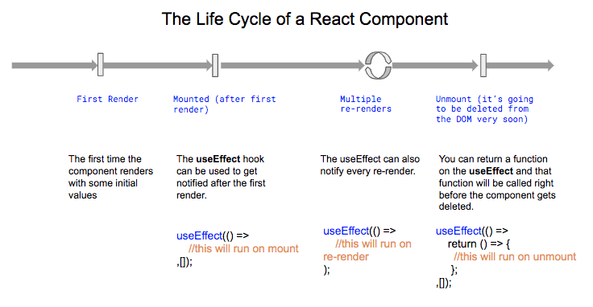
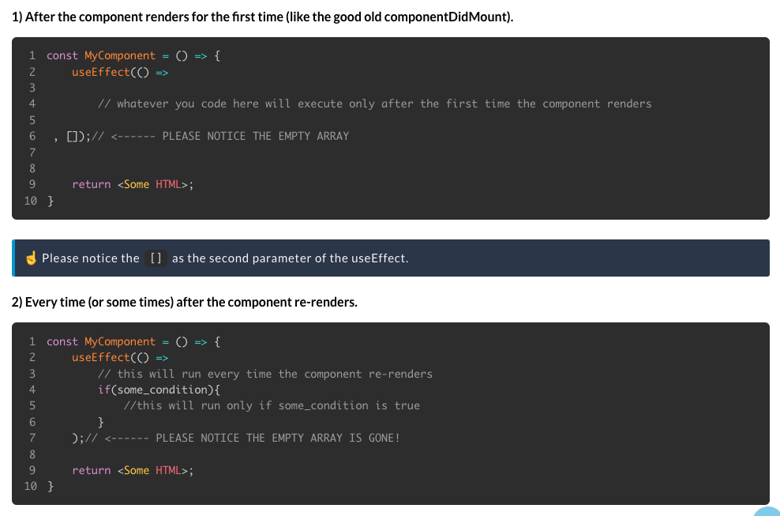

# Mis dudas sobre React

## 1. clearInterval()

Sigo sin entender qué hace o por qué se necesita mezclar con useEffect, por ejemplo, a la hora de disponer un reloj en pantalla.

## 2. El ciclo de vida de los componentes

## 3. El array de dependencias

## ¿Cómo se eligen las variables a la hora de hacer el `fetch` de una URL?

    ...

    const Home = () => {
        const [quote, setQuote] = useState("");

        useEffect(() => {
            fetch("https://uselessfacts.jsph.pl/random.json?language=en")
                .then((response) => {                                                   //  Why "response"?
                    if (!response.ok) {
                        throw Error(response.statusText);
                    }
                    // console.log("The response was successful!");
                    return response.json();
                })
                .then((thisResponse) => {                                               //  Why "thisResponse"?
                    setQuote(thisResponse.text);
                })
                .catch((error) => {                                                     //  Why "error"?
                    // console.log("Looks like there was a problem: \n", error);
                });
        }, []);

        ...
