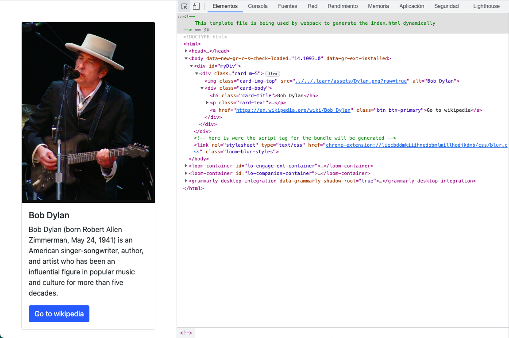
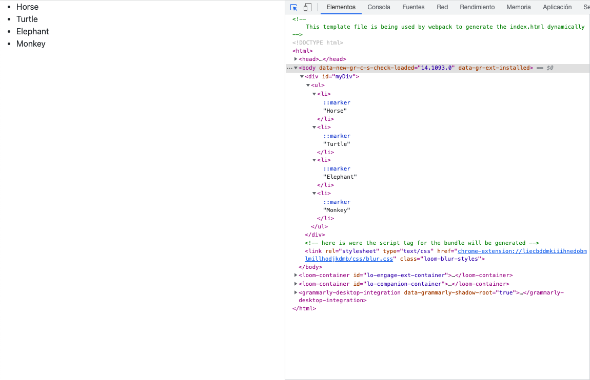

# Understanding React

## 1 Hello World

1. React.js is a rendering library.

    - What is a rendering library?

2. React.js comes with a function called `ReactDOM.render` that can be seen as a replacement for the classic `innerHTML` property.

    - The ReactDOM.render function receives two parameters:

        - What to render (the inner HTML).

        - Where to render it (DOM element).

**Example**:

```
import React from 'react'; // Import the react library.
import ReactDOM from 'react-dom'; // Import reactDOM to make React generate HTML

let output = <span>James is 12 years old</span> // HTML that will be rendered

const myDiv = document.querySelector('#myDiv'); // A DOM element that will contain the HTML generated by React

ReactDOM.render(output, myDiv);

```

**Result**:


### 1.1 Hello JSX

JSX also allows you to easily include variables into your HTML, for example, lets assume that you have the following variable available:

`let age = 12;`

Including the value of that variable into our HTML code _dynamically_ can be achieved like so:

`let output = <span> James is { age } years old </span> // Note the position of the curly brackets wrapping the variable`

**Example**:

```

import ReactDOM from 'react-dom'; // Using react-dom to render whichever content into the DOM
let age = 12;
let output = <span> James is { age } years old </span> // Note the position of the curly brackets wrapping the variable
ReactDOM.render(output, document.querySelector('#myDiv')); // Rendering "output" inside #myDiv

```

The resulting website HTML document will look like this:

**Result**:

```

<div id="myDiv">
    <span>James is 12 years old</span>
</div>

```

### 1.2 Rendering from objects

We have the following JS object containing a customer information:

```

const customer = {
    first_name: 'Bob',
    last_name: 'Dylan'
};

```

To retrieve any property from the `customer` object we have to use the dot (.) operator like so:

`console.log(customer.first_name); // Will print "Bob" on the console.`

**Example**:

    import React from "react";
    import ReactDOM from "react-dom";

    const customer = {
    first_name: "Bob",
    last_name: "Dylan"
    };

    const output = <div><h1>My name is {customer.first_name}</h1><h2>My last name is {customer.last_name}</h2></div>;

    ReactDOM.render(output, document.querySelector("#myDiv"));

**Result**:


### 1.3 Building a layout

Using _React.js_, create a **Bootstrap Card** with the information contained into the `data` object.

    const data = {
        image: "../../.learn/assets/Dylan.png?raw=true",
        cardTitle: "Bob Dylan",
        cardDescription: "Bob Dylan (born Robert Allen Zimmerman, May 24, 1941) is an American singer/songwriter, author, and artist who has been an influential figure in popular music and culture for more than five decades.",
        button: {
            url: "https://en.wikipedia.org/wiki/Bob_Dylan",
            label: "Go to wikipedia"
        }
    };

    import React from "react"; //Main React.js library
    import ReactDOM from "react-dom"; //we use ReactDOM to render into the DOM

    let content = (
        <div className="card m-5">
            
            <div className="card-body">
                <h5 className="card-title">{data.cardTitle}</h5>
                <p className="card-text">{data.cardDescription}</p>
                <a href={data.button.url} className="btn btn-primary">
                    {data.button.label}
                </a>
            </div>
        </div>
    );
    ReactDOM.render(content, document.querySelector("#myDiv"));

**Result**:



### 1.4 Building from arrays

With React.js (`jsx`) arrays of HTML items can also be created, like so:

    const namesInHTML = [
        <li>Bob Dust</li>,
        <li>Fredy Mercury</li>,
        <li>Shazam Nikola</li>,
        <li>Wilibin Walabam</li>
    ];

    const content = <ul>{namesInHTML}</ul>;

    ReactDOM.render(content, document.querySelector("#myDiv"));

The resulting HTML on the website will be:

    <div id="myDiv">
        <ul>
            <li>Bob Dust</li>
            <li>Fredy Mercury</li>
            <li>Shazam Nikola</li>
            <li>Wilibin Walabam</li>
        </ul>
    </div>

Now, we want React to render the following output into the document:

    <ul class="nav">
        <li class="nav-item">
            <a class="nav-link" href="#">Link to google.com</a>
        </li>
        <li class="nav-item">
            <a class="nav-link" href="#">Link to facebook.com</a>
        </li>
        <li class="nav-item">
            <a class="nav-link" href="#">Link to amazon.com</a>
        </li>
    </ul>

This would be the necessary code:

    import React from "react"; // Main React.js library
    import ReactDOM from "react-dom"; // We use ReactDOM to render into the DOM

    const navlinkItems = [
        <li key="1" className="nav-item">
            <a className="nav-link" href="#">
                Link to google.com
            </a>
        </li>,
        <li key="2" className="nav-item">
            <a className="nav-link" href="#">
                Link to facebook.com
            </a>
        </li>,
        <li key="3" className="nav-item">
            <a className="nav-link" href="#">
                Link to amazon.com
            </a>
        </li>,
    ];

    const content = <ul className="nav">{navlinkItems}</ul>;

    ReactDOM.render(content, document.querySelector("#myDiv"));

**Result**:


### React _should_ ask you to use keys on each item of the array.

-   A “key” is a special string attribute you need to include when creating lists of elements in React.

-   Keys are used in React to give an identity to the elements in the lists in order to know which items in the list are changed, updated, or deleted.

-   It is recommended to use a string as a key that uniquely identifies the items in the list

-   Array indexes can also be assigned as keys to the list items, although this is highly discouraged because if the elements of the arrays get reordered in the future, it will get confusing for the developer as the keys for the elements will also change.

## 2 Mapping array to `<li>`

Let us update the code's `.map` function to create a new array of `<li>`'s so that each one of them corresponds to one animal from the original array.

    import React from "react";
    import ReactDOM from "react-dom";

    const animals = ["Horse", "Turtle", "Elephant", "Monkey"];

    const animalsInHTML = animals.map((singleAnimal, i) => {
        return <li key={i}>{singleAnimal}</li>;
    });

    ReactDOM.render(<ul>{animalsInHTML}</ul>, document.querySelector("#myDiv"));

**Result**:



### 2.1 Mapping array objects to `<li>`

Update the code's .map function to create a new array of <li>'s that each of them corresponds one animal from the original array and include them all together inside the website.

    import React from "react";
    import ReactDOM from "react-dom";

    const animals = [{ label: "Horse" }, { label: "Turtle" }, { label: "Elephant" }, { label: "Monkey" }];

    const animalsInHTML = animals.map((singleAnimal, i) => {
    	return <li key={i}>{singleAnimal.label}</li>;
    });

    ReactDOM.render(<ul>{animalsInHTML}</ul>, document.querySelector("#myDiv"));

### 2.2 Mapping array of objects to `<li>`

When **mapping an array of data** to convert it into **an array of HTML**, you have to specify a "mapping function" that will receive each item from the original _data array_, transform it and insert it into the new _HTML array_.

**Example**:

    import React from "react"; // Importing main React.js library
    import ReactDOM from "react-dom"; // Importing ReactDOM to render elements into the DOM

    const planets = ["Mars", "Venus", "Jupiter", "Earth", "Saturn", "Neptune"]; // Declaration of initial array ("Data Array")

    // Declaration of the "mapping function"
    // The function receives 2 args: each one of the elements of the initial array and their respective indexes
    // It utilizes the index for the key and the value of each item ("planet") as the innerHTML of the <li> tag
    // It adds the className "list-group-item" to convey Bootstrap standards

    const myMappingFunction = (planet, i) => {
        return (
            <li key={i} className="list-group-item">
                {planet}
            </li>
        );
    };

    // The new "HTML Array" is created

    const planetsInHTML = planets.map(myMappingFunction);

    // The variable content is defined

    const content = <ul className="list-group m-5">{planetsInHTML}</ul>;

    // We render the "content" (WHAT), within the box identified with the id "myDiv"

    ReactDOM.render(content, document.querySelector("#myDiv"));

**Result**:


