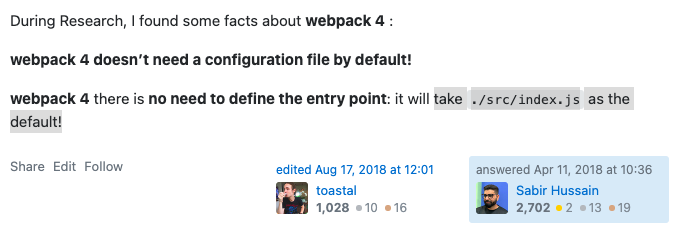
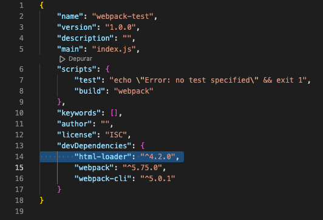
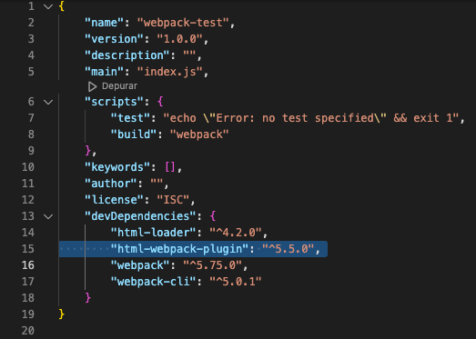

# WebPack SetUp

Practicing the setup of a web project with WebPack, some difficulties may be met in the process of configuration at its earliest stage.

## 1. The structure of the project

I have a brand new project folder by the name of `card-generator-webpack`. The structure of that folder is as follows:

    __/ card-generator-webpack
      |__/ src
      |  |__/ assets / img
      |              |__ favicon.jpeg
      |  |__ app.js
      |  |__ index.html
      |  |__ styles.css
      |__ README.md

## 2. Initializing WebPack

The first two commands which I run are `npm init -y` and `npm install webpack webpack-cli --save-dev`. I do so at the root of my project via Terminal. Once I've done it, the structure of my project looks like so:

    __/ card-generator-webpack
      |__/ (+) node_modules
      |__/ src
      |  |__/ assets / img
      |              |__ favicon.jpeg
      |  |__ app.js
      |  |__ index.html
      |  |__ styles.css
      |__ (+) package-lock.json
      |__ (+) package.json
      |__ README.md

> Notice how new files and folders are depicted with a `(+)` at the beginning of its corresponding lines. Likewise, the removal of files and folders will be depicted with a `(-)` at the beginning of their corresponding lines.

## 3. Meeting the first issue

Probably in a very naive fashion, I go to the `package.json` of my project and, under scripts, I add `"build": "webpack"` for this final result:

    {
        "name": "card-generator-webpack",
        "version": "1.0.0",
        "description": "",
        "main": "index.js",
        "scripts": {
            "test": "echo \"Error: no test specified\" && exit 1",
            "build": "webpack"
        },
        "keywords": [],
        "author": "",
        "license": "ISC",
        "devDependencies": {
            "webpack": "^5.75.0",
            "webpack-cli": "^5.0.1"
        }
    }

But, after running `npm run build`, I get a quite long error as output on the Terminal. This is it:

    ERROR in main
    Module not found: Error: Can't resolve './src' in '/Users/AGLAYA/Local Sites/card-generator-webpack'
    resolve './src' in '/Users/AGLAYA/Local Sites/card-generator-webpack'
    using description file: /Users/AGLAYA/Local Sites/card-generator-webpack/package.json (relative path: .)
    Field 'browser' doesn't contain a valid alias configuration
    using description file: /Users/AGLAYA/Local Sites/card-generator-webpack/package.json (relative path: ./src)
    no extension
    Field 'browser' doesn't contain a valid alias configuration
    /Users/AGLAYA/Local Sites/card-generator-webpack/src is not a file
    .js
    Field 'browser' doesn't contain a valid alias configuration
    /Users/AGLAYA/Local Sites/card-generator-webpack/src.js doesn't exist
    .json
    Field 'browser' doesn't contain a valid alias configuration
    /Users/AGLAYA/Local Sites/card-generator-webpack/src.json doesn't exist
    .wasm
    Field 'browser' doesn't contain a valid alias configuration
    /Users/AGLAYA/Local Sites/card-generator-webpack/src.wasm doesn't exist
    as directory
    existing directory /Users/AGLAYA/Local Sites/card-generator-webpack/src
    using description file: /Users/AGLAYA/Local Sites/card-generator-webpack/package.json (relative path: ./src)
    using path: /Users/AGLAYA/Local Sites/card-generator-webpack/src/index
    using description file: /Users/AGLAYA/Local Sites/card-generator-webpack/package.json (relative path: ./src/index)
    no extension
    Field 'browser' doesn't contain a valid alias configuration
    /Users/AGLAYA/Local Sites/card-generator-webpack/src/index doesn't exist
    .js
    Field 'browser' doesn't contain a valid alias configuration
    /Users/AGLAYA/Local Sites/card-generator-webpack/src/index.js doesn't exist
    .json
    Field 'browser' doesn't contain a valid alias configuration
    /Users/AGLAYA/Local Sites/card-generator-webpack/src/index.json doesn't exist
    .wasm
    Field 'browser' doesn't contain a valid alias configuration
    /Users/AGLAYA/Local Sites/card-generator-webpack/src/index.wasm doesn't exist

    webpack 5.75.0 compiled with 1 error and 1 warning in 503 ms

Now, the only way that I've found to solve all of that in order to get WebPack to create the famous folder dist has been adding the path `./src/app.js` to the `"build": "webpack"` that I've just added before, so that the line ends up reading like this:

    "build": "webpack ./src/app.js"

And, finally, once I run `npm run build`, I do now get the folder dist, so that I my project's structure is now:

    __/ card-generator-webpack
      |__/ (+) dist
      |  |__ (+) main.js
      |__/ node_modules
      |__/ src
      |  |__/ assets / img
      |              |__ favicon.jpeg
      |  |__ app.js
      |  |__ index.html
      |  |__ styles.css
      |__ package-lock.json
      |__ package.json
      |__ README.md

> **Note**: Later on, the meaning of that `main.js` folder - as well as the meaning of many other files which will get to have in that `dist` folder - will be dully explained.

Thus - and to start with - my questions would be:

1. **What is that error yielded on the Terminal exactly saying?**

2. **Why can't that error be solved by changing the `"main": "index.js"` to `"main": "app.js"`, or to `"main": "./src/app.js"` in the `package.json`?**

3. **Why the only solution that I've found by myself implies adding an entry point to my `"build"` script?**

4. **Is it _logical_ to add an entry point to my `"build"`?**

Finally, according with WebPack's documentation:

> We also need to adjust our `package.json` file in order to make sure we mark our package as `private`, as well as **removing the main entry**. This is to prevent an accidental publish of your code.

So...

5. **Why does WebPack's documentation read that removing the main entry is necessary?**

6. **What does WebPack's documentation mean with "accidental publish of your code"?**

7. **Why could our code be published by accident and how does `"private": true` help to prevent this from happening?**

8. **What if I want to willingly publish it? Should I erase or change this `"private": true` value?**

### Solutions

For what it may be worth, and according to what I've kept on researching, the solution to the problem lies in the fact that Webpack

> **take[s] `./src/index.js` as the default!**

---

**[Source](https://stackoverflow.com/questions/49772863/webpack-4-error-in-entry-module-not-found-error-cant-resolve-src)**



---

So either the .js file that we want to use as the entry point is called `index.js`, and it's in the `./src/` path or _things blow up_.

Now, if we want the entry point to be different from the one taken by WebPack by default, we have two possible solutions:

#### First solution

_Tweaking_ a bit our `package.json` right where we define the script that usually gets the name of `"build"`. In this case, what needs to be done is to add an entry point after the `"webpack"` value. That is, it should end up like this:

    "scripts": {
        "test": "echo \"Error: no test specified\" && exit 1",
        "build": "webpack [entry point]"
    },

Or, for example, if we were using the `app.js` file in the root of our document:

    "scripts": {
        "test": "echo \"Error: no test specified\" && exit 1",
        "build": "webpack ./app.js"
    },

#### Second solution

The second solution is to start by adding the configuration file `webpack.config.js` to the root of our project. Within, we'll need to add:

    module.exports = {
        entry: "./app.js",
    };

#### Third solution

Forget about all of it and just name your main .js file as `index.js` and place it within the path `./src/`.

We're gonna opt out for this third solution in such a way that our folder structure would now be:

    __/ card-generator-webpack
      |__/ (-) dist
      |  |__ (-) main.js
      |__/ node_modules
      |__/ src
      |  |__/ assets / img
      |              |__ favicon.jpeg
      |  |__ (-) app.js
      |  |__ (+) index.js
      |  |__ index.html
      |  |__ styles.css
      |__ package-lock.json
      |__ package.json
      |__ README.md

Although, for educational purposes, we're going to pretend that we haven't run `npm run build` one single time, in such a fashion that, as you can see, folder `dist` and its content (`main.js`) are now gone, resulting in:

    __/ card-generator-webpack
      |__/ node_modules
      |__/ src
      |  |__/ assets / img
      |              |__ favicon.jpeg
      |  |__ index.js
      |  |__ index.html
      |  |__ styles.css
      |__ package-lock.json
      |__ package.json
      |__ README.md

And, for starters, that would solve the enormous error that I showed in the main message of this thread, as well as the first question, which was:

> 1. **What is that error yielded on the Terminal saying?**

So what the error is saying - or so I believe - is that there is no `index.js` file to resolve in the `./src/` path—or, said differently, that `./src/index.js` doesn't exist.

I still can't find a concrete explanation for the second question. This is:

> 2. **Why can't that error be solved by changing the `"main": "index.js"` to `"main": "app.js"` (or to `"main": "./src/app.js"`) in our `package.json`?**

The respective answers to the third and fourth questions are also already obvious. That is:

> 3. **Why the only solution I've found by myself implies adding an entry point to my `"build"`?**

The answer would be:

Because, indeed, it is one of the possible solutions.

And...

> 4. **Is it logical to add an entry point to my `"build"`?**

Well, I assume that it is logical because, once again, WebPack defaults to `./src/index.js` as its entry point.

Now, regarding questions 5 and 6, my doubts remain, in case somebody out there is kind enough to find an answer to share.

Thanks!

### Conclusions (1)

After all of this _struggle_, let's say that we run `npm run build` once.

Our `dist` folder would be created containing one single .js file (`main.js`).

Now, if we call this `main.js` in our **source** HTML file content (`<script src="../dist/main.js"></script>`), it _should_ work properly. I am italicing 'should' because, for example, if our HTML code contains inline calls to any of the functions of our original JavaScript code, those won't run—since our new `main.js` does not include any of those calls.

This is, let's say that our HTML code was like so:

    <!DOCTYPE html>
    <html>
        <head>
            <meta charset="UTF-8" />
            <meta name="viewport" content="width=device-width, initial-scale=1.0" />
            <title>21 BlackJack</title>
            <link rel="stylesheet" href="style.css">
        </head>
        <body onload="initialConfig();">
            <div class="card">
            <div class="card-header">
                <div class="header-symbol"></div>
                </div>
            <div class="card-body">
                <div class="body-symbol"></div>
            </div>
            <div class="card-footer">
                <div class="footer-symbol"></div>
            </div>
            </div>
            <div id="button-div">
            <button class="button" onclick="initialConfig();">Click me</button>
            </div>
            <script src="app.js"></script>
        </body>
    </html>

Both script calls `<body onload="initialConfig();">`and `<button class="button" onclick="initialConfig();">Click me</button>` would not work, as our `main.js` would now read as:

    (()=>{let e,o,t=["♦","♥","♠","♣"],r=["A","2","3","4","5","6","7","8","9","10","J","Q","K"];const d=document.querySelector(".header-symbol"),s=document.querySelector(".footer-symbol"),a=document.querySelector(".body-symbol"),l=()=>{e=t[Math.floor(4*Math.random())],o=r[Math.floor(13*Math.random())],d.innerText=e,s.innerText=e,a.innerText=o,"♦"===e||"♥"===e?(d.classList.add("red"),s.classList.add("red"),a.classList.add("red")):(d.classList.remove("red"),s.classList.remove("red"),a.classList.remove("red"))};window.onload=l(),document.querySelector(".button").addEventListener("click",l)})();

Therefore, if we have those functions called in our HTML code as it points to `<script src="../dist/main.js"></script>`, there's no way they would be found in our `main.js` file, as we can see the code above. What we could do instead would be to create the source .js file with _Event Listeners_ functions which produced the desired effects, and then packing up that source file using `npm run build` in a normal manner in order to have those _Event Listeners_ functions compiled into the final output `main.js` file.

## 4. Configuring the `mode`

By default, Webpack runs in _production_ mode. We will notice it once we run `npm run build` and read on the Terminal's output this:

    The 'mode' option has not been set, webpack will fallback to 'production' for this value.
    Set 'mode' option to 'development' or 'production' to enable defaults for each environment.
    You can also set it to 'none' to disable any default behavior. Learn more: https://webpack.js.org/configuration/mode/

Basically, it is time - in case it's not been done yet - to create a config file at the root of our project. The name of the file can be many, but the recommendation would be to either call it `webpack.config.js`, or to create two of them and call them, resepctively, `dev.config.js` and `prod.config.js`. This second _strategy_ is so that we have two configuration files set up—one for _development_ mode, and one for _production_ mode.

At the moment, we are going to go with `webpack.config.js`.

According to [WebPack's official documentation](https://webpack.js.org/configuration/mode/#root):

---

# Mode

Providing the mode configuration option tells webpack to use its built-in optimizations accordingly.

`string = 'production': 'none' | 'development' | 'production'`

## Usage

Provide the `mode` option in the config...

    module.exports = {
        mode: 'development',
    };

...or pass it as a CLI argument:

`webpack --mode=development`

---

Thus, we create the `webpack.config.js` file and we add as its content:

    module.exports = {
        mode: 'development',
    };

... or:

    module.exports = {
         mode: 'production',
    };

## 5. Loading our HTML file(s) to the `dist` folder

In order to load our HTML file(s) to the `dist` folder, we are going to need the **[HTML Loader](https://webpack.js.org/loaders/html-loader/)**.

According to the official WebPack's HTML-loader documentation:

---

# Getting Started

To begin, you'll need to install html-loader by running this command on the Terminal:

`npm install --save-dev html-loader`

Once you've done it, you'll be able to see that another dependency has been added to the `package.json` file, like so:



Then, add a call to HTML-Loader to your webpack config file (`webpack.config.js`):

    module.exports = {
        mode: "development",
        module: {
            rules: [
                {
                    test: /\.html$/i,
                    loader: "html-loader",
                },
            ],
        },
    };

That's just a way to tell WebPack **to load** the HTML. Now, **what should WebPack do with it**?

For that, we are going to need a plugin. In this case, **[HtmlWebpackPlugin](https://webpack.js.org/plugins/html-webpack-plugin/)**.

According to WebPack's official documentation on this plugin:

---

# HtmlWebpackPlugin

The **HtmlWebpackPlugin** simplifies creation of HTML files to serve your webpack bundles. This is especially useful for webpack bundles that include a hash in the filename which changes every compilation. You can either let the plugin generate an HTML file for you, supply your own template using lodash templates, or use your own loader.

## Installation

Run the `npm install --save-dev html-webpack-plugin` command in Terminal.

The `package.json` file should now look like so:



## Basic Usage

The plugin will generate an HTML5 file for you that includes all your webpack bundles in the body using script tags.

---

Now, to add the plugin to your webpack configuration (file), include:

1. `const HtmlWebpackPlugin = require('html-webpack-plugin');` out of `module.exports`.

2. `plugins: [new HtmlWebpackPlugin()],` within `module.exports`.

At the end, this should be the result:

    const HtmlWebpackPlugin = require("html-webpack-plugin");

    module.exports = {
        mode: "development",
        module: {
            rules: [
                {
                    test: /\.html$/i,
                    loader: "html-loader",
                },
            ],
        },
        plugins: [new HtmlWebpackPlugin()],
    };

Once this has been done, if we run `npm run build`, we'll see that a new `index.html` has been created within the `dist` folder of our project, so that our project now should look like so:

    __/ card-generator-webpack
      |__/ node_modules
      |__/ (+) dist
         |__/ (+) index.html
         |__/ (+) main.js
      |__/ src
      |  |__/ assets / img
      |              |__ favicon.jpeg
      |  |__ index.js
      |  |__ index.html
      |  |__ styles.css
      |__ package-lock.json
      |__ package.json
      |__ README.md

### Dragging the content of our original HTML file

Now, if we take a look at the HTML file that has just been generated within our `dist` file, we will notice that:

1. The content of `<title>` has changed.

2. The `main.js` file that we have within our `dist` file is being called as `defer` in that HTML file's content.

3. There's nothing left of our original HTML code. If we take a view at the live version of our project now, we will only see whichever content has been generated by the `main.js` stored in the `dist` folder.

So it is more than likely that we want to see our original HTML code (the one that we had in the _source_ (`src`) folder represente in the `index.html` that we now have in our `dist` folder.

In order to do that, we will need to draw upon the **HtmlWebpackPlugin**'s official documentation, which can be found on [GitHub](https://github.com/jantimon/html-webpack-plugin).

If we scroll down the `README.md` file, we will reach the "OPTIONS" part.

AS many options as we want to use, we will place them as an object within the calling of the `HtmlWebpackPlugin()`in our `webpack.config.js`. This is:

    ...
    plugins: [
        new HtmlWebpackPlugin({
            title: "Webpack Test",
            filename: "my-index.html",
            template: "./src/index.html",
            favicon: "./src/assets/img/favicon.jpeg",
        }),
    ],
    ...

In this example:

-   `title` gives us the opportunity to choose the content of our `<title>` tag.

-   `filename` gives us the chance to rename the output HTML file.

-   `template` will drag all the content of our source HTML file.

-   `favicon` allows us to give a path where to find (and drag to the output) our favicon.

If we now run `npm run build`, we will see two things:

1. A `my-index.html`file has been created. Its content reflects the given title and the tag of the favicon:

```
    ...
    <title>Webpack Test</title>
    <meta name="viewport" content="width=device-width, initial-scale=1">
    <link rel="icon" href="favicon.jpeg">
    <script defer src="main.js"></script></head>
    ...
```

2.  `my-index.html` has been added to the former contents of our `dist` folder, so that now we have:

        __/ card-generator-webpack
        |__/ node_modules
        |__/ dist
            |__/ index.html
            |__/ main.js
            |__/ (+) my-index.html
        |__/ src
        |  |__/ assets / img
        |              |__ favicon.jpeg
        |  |__ index.js
        |  |__ index.html
        |  |__ styles.css
        |__ package-lock.json
        |__ package.json
        |__ README.md

Which is more than likely a quite undesired effect.

Let's see how to solve that out.

## How to clean the output

In order to prevent outputted files to keep piling up within our `dist` folder, all we have to do is add some more code to our configuration file (`webpack.config.js`), as explained in [WebPack's official documentation](https://webpack.js.org/guides/output-management/#cleaning-up-the-dist-folder):

    output: {
        clean: true,
    },

This way, no matter how crowded our `dist` folder is, we will end up with the last generated files of each kind, in this case:

        __/ card-generator-webpack
        |__/ node_modules
        |__/ dist
            |__/ (-) index.html
            |__/ main.js
            |__/ my-index.html
        |__/ src
        |  |__/ assets / img
        |              |__ favicon.jpeg
        |  |__ index.js
        |  |__ index.html
        |  |__ styles.css
        |__ package-lock.json
        |__ package.json
        |__ README.md

## 3. Meeting the second issue

At this point, we should
